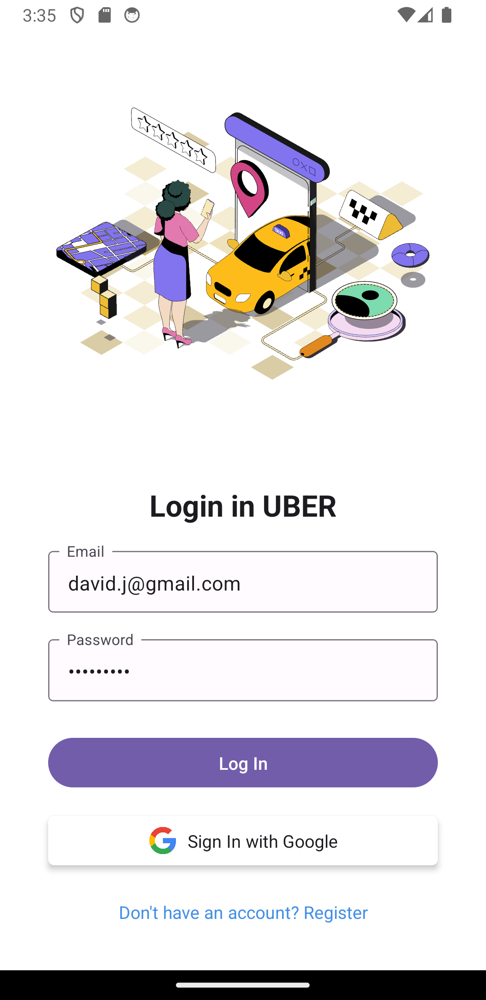
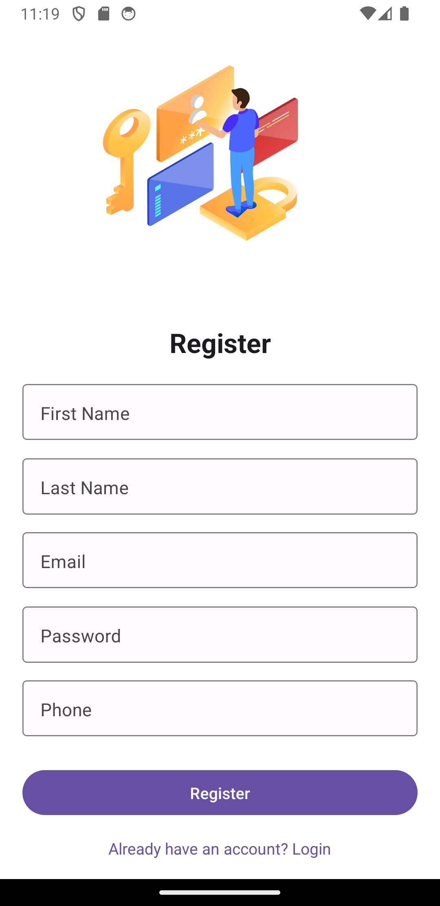
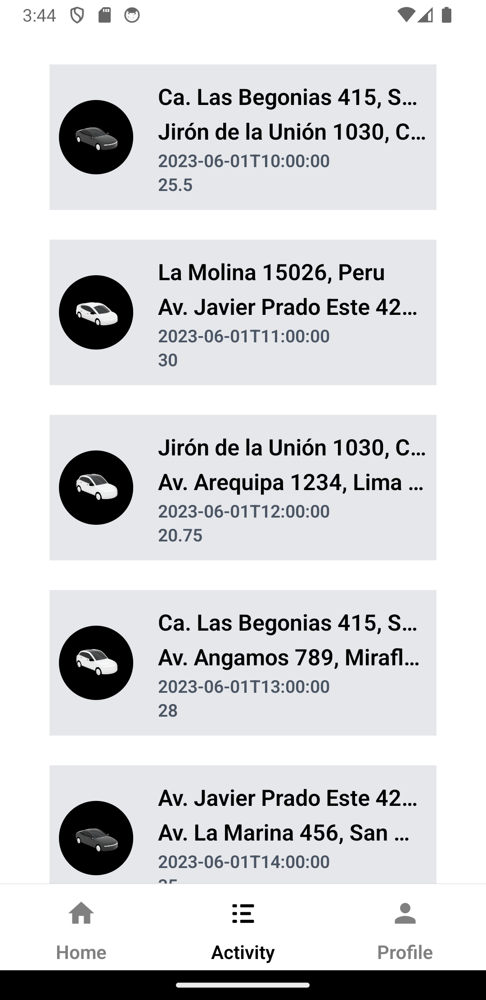
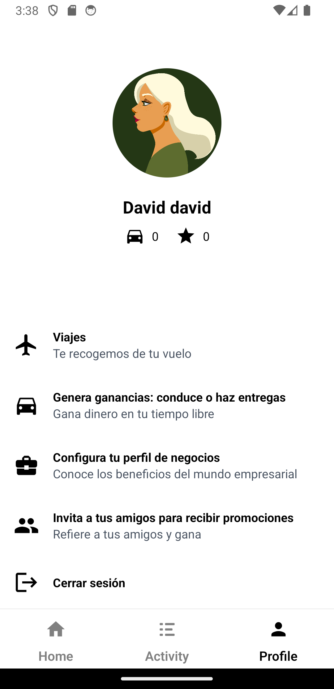

# 🚗 **Simulador de Uber - App Móvil** 🚗

Este es un proyecto de desarrollo de una aplicación móvil que simula la experiencia de Uber. La app está construida con React Native y se conecta a un backend previamente desarrollado para gestionar usuarios y viajes. A continuación, se detallan los aspectos clave de la aplicación móvil.

## 🛠️ **Tecnologías Utilizadas**

- **React Native**: Framework principal para desarrollar la app móvil.
- **React Navigation**: Para la navegación entre pantallas.
- **Axios**: Para las solicitudes HTTP al backend.
- **React Native Paper**: Para los componentes de interfaz de usuario basados en Material Design.
- **Expo**: Plataforma utilizada para desarrollo y despliegue en dispositivos móviles.
- **Expo Secure Store**: Para almacenar de manera segura los tokens de autenticación.

## 🌟 **Características de la Aplicación**

La aplicación ofrece las siguientes pantallas y funcionalidades esenciales para simular un sistema de transporte tipo Uber:

### 1. **Pantalla de Login**
   - Permite a los usuarios ingresar con su nombre de usuario y contraseña.
   - Autenticación con el backend usando el endpoint `POST /auth/login`.

### 2. **Pantalla de Registro**
   - Los nuevos usuarios pueden registrarse proporcionando su nombre, correo electrónico, número de teléfono y contraseña.
   - Conexión con el backend para crear nuevos usuarios a través del endpoint `POST /auth/register`.

### 3. **Pantalla de Actividad**
   - Muestra el historial de viajes realizados por el usuario.
   - Se obtiene la información desde el backend usando el endpoint `GET /ride/user`.

### 4. **Pantalla de Perfil**
   - El usuario puede ver y editar su información personal, como nombre y correo electrónico.
   - El backend proporciona esta información a través del endpoint `GET /passenger/me`.
   - Incluye un botón para cerrar sesión, que eliminará el token de autenticación almacenado en el dispositivo.

## 📱 **Pantallas de la Aplicación**

### **Login**

La pantalla de login permite al usuario acceder a su cuenta con un nombre de usuario y contraseña.



### **Register**

La pantalla de registro permite crear una nueva cuenta con información básica como nombre, correo y teléfono.



### **Activity**

Esta pantalla muestra un historial de los viajes previos del usuario, permitiéndole visualizar los detalles de sus desplazamientos.



### **Profile**

En esta pantalla, el usuario puede ver y editar su información personal y cerrar sesión.



## 📦 **Dependencias**

A continuación, se listan las principales dependencias necesarias para este proyecto:

- **@expo/vector-icons**: Para agregar íconos en la interfaz.
- **react-native-paper**: Para componentes de UI basados en Material Design.
- **twrnc**: Para utilizar Tailwind CSS en la parte de los estilos.
- **react-navigation**: Para la navegación dentro de la aplicación.
- **axios**: Para hacer solicitudes HTTP al backend.
- **expo-secure-store**: Para almacenar el token de sesión de manera segura.

## 🚀 **Instrucciones de Instalación y Ejecución**

1. **Clonar el repositorio**:

```bash
git clone <url_del_repositorio>
cd <directorio_del_proyecto>
```

2. **Clonar el repositorio**:

```bash
npm install
```

3. **Iniciar la aplicación**:

```bash
npx expo start
```

4. **Conectar el backend**:
   - Para que la aplicación se conecte al backend, asegúrate de que esté ejecutándose en un servidor accesible desde tu dispositivo móvil. Expo no funcionará con `localhost` o `127.0.0.1`, así que utiliza la IP de tu máquina local.
   - Para obtener la IP, ejecuta `npx expo start` y busca la dirección IP en la consola.

## ⚙️ **Recomendaciones**
- Asegúrate de tener configurado el backend correctamente para que la aplicación funcione sin problemas.
- Si utilizas Expo, ten en cuenta que no puedes usar `localhost` o `127.0.0.1` en tu red local. Utiliza la IP de la máquina donde se encuentra el backend.

## 🛠️ **Backend Integrado**
La app se conecta al siguiente backend para la autenticación de usuarios, gestión de viajes y más:
- API Base URL: `http://<IP_DEL_BACKEND>:<PUERTO>`
- Endpoints:
  - **Login**: `POST /auth/login`
  - **Register**: `POST /auth/register`
  - **Historial de viajes**: `GET /ride/user`
  - **Información del usuario**: `GET /passenger/me`

---

## 📄 **Licencia**

Este proyecto está bajo la licencia MIT. Puedes usarlo, modificarlo y compartirlo libremente.
