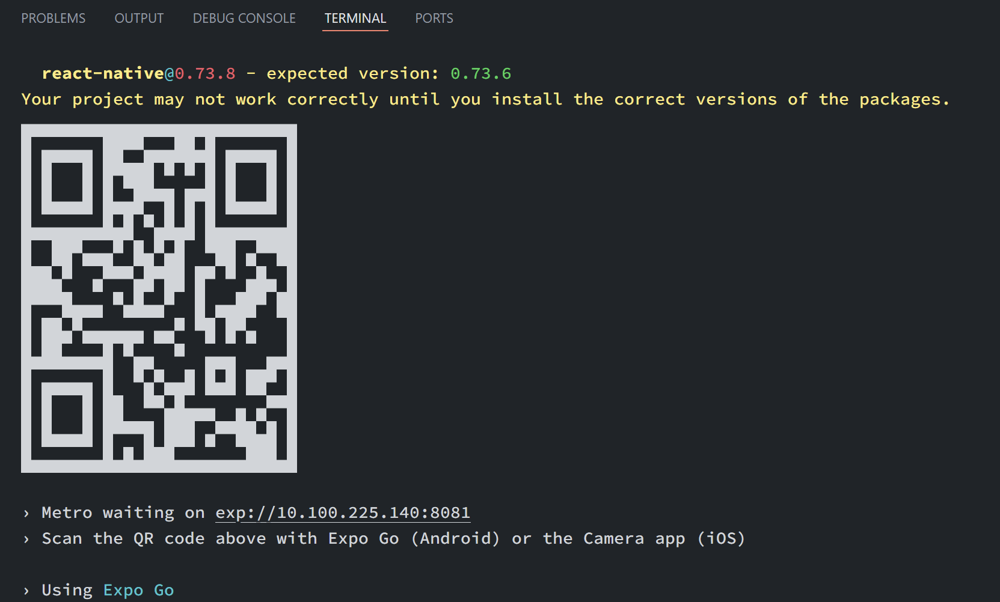

[](https://classroom.github.com/a/hyJiSbO7)
## 🌟 Implementación de Frontend Mobile con React Native 🌟

En este laboratorio, nos centraremos en la creación de un frontend móvil utilizando React Native. Este se conectará con el backend proporcionado en la entrega anterior. Aquí están los detalles:

### 📱 Screens a Implementar

1. **Login**: 
   - Pantalla de inicio de sesión con dos campos de texto para el usuario y la contraseña, y un botón para iniciar sesión.
   - ⚙️ **Requisito**: Usar el componente `<TextInput />` de `react-native-paper` con `accessibilityLabel` en `username` y `password`.

2. **Register**: 
   - Pantalla de registro con tres campos de texto para usuario, contraseña y correo, y un botón para registrarse.
   - ⚙️ **Requisito**: Usar `<TextInput />` de `react-native-paper` con `accessibilityLabel` en `first-name`, `last-name`, `password`, `email` y `phone`.

3. **Activity**:
   - Pantalla que muestra el historial de viajes del usuario con paginación.
   - ⚙️ **Requisito**: Mostrar historial obtenido del endpoint `GET /ride/user`.

4. **Profile**:
   - Pantalla que muestra la información del usuario y permite modificarla, además de cerrar sesión.
   - ⚙️ **Requisito**: Mostrar información obtenida del endpoint `GET /passenger/me` y un botón de "Cerrar Sesión".

### 📦 Librerías Recomendadas

- [**@expo/vector-icons**](https://docs.expo.dev/guides/icons/) y **react-native-icons**: Para agregar íconos.
- [**react-native-paper**](https://callstack.github.io/react-native-paper/): Para componentes de Material Design. Se recomienda para los componentes de UI.
- **twrnc**: Para estilos usando Tailwind CSS en React Native. Tambien se puede usar [NativeWind]( https://www.nativewind.dev/)
- [**@react-navigation/native**](https://reactnavigation.org/docs/getting-started/) y [**@react-navigation/native-stack**](https://reactnavigation.org/docs/native-stack-navigator/): Para la navegación entre pantallas.
- [**expo-router**](https://docs.expo.dev/router/introduction/): Para la navegación en aplicaciones expo. Usa react navigation por debajo.
- [**axios**](https://axios-http.com/docs/intro): Obligatorio para peticiones al backend, ya que los tests están basados en esta librería.
- [**expo-secure-store**](https://docs.expo.dev/versions/latest/sdk/securestore/): Obligatorio para guardar el token de sesión de forma segura.

### 🛠️ Recomendaciones

- Instalar dependencias del proyecto con `npm install`.
- Ejecutar el proyecto con `npm start` o `npx expo start`.
- Recordar que `Expo` no funciona con `localhost` o `127.0.0.1`, deben usar la dirección IP de su máquina para conectar con el backend. Si necesitan ayuda, ejecuten `npx expo start` y en la consola verán la IP:
  ```
  > Metro waiting on exp://123.456.78.90:19000
  ```
  

### 📅 Entrega

#### Login

<div style="display: flex; flex-direction: row; justify-content: center; width: 100%; gap: 20px;">
  
</div>

- Los campos deben ser un componente `<TextInput />` de `react-native-paper` con `accessibilityLabel` en `username` y `password`.

#### Register

<div style="display: flex; flex-direction: row; justify-content: center; width: 100%; gap: 20px;">
  
</div>

- Los campos deben ser un componente `<TextInput />` de `react-native-paper` con `accessibilityLabel` en `first-name`, `last-name`, `password`, `email` y `phone`.

#### Profile

<div style="display: flex; flex-direction: row; justify-content: center; width: 100%; gap: 20px;">
  
</div>

- Debe contener un botón que permita cerrar sesión con el texto `Cerrar Sesión` para ser reconocido por los test.
- Debe mostrar la información del usuario obtenida del endpoint `GET /passenger/me`.

#### Activity

<div style="display: flex; flex-direction: row; justify-content: center; width: 100%; gap: 20px;">
  
</div>

- Debe mostrar el historial de viajes del usuario obtenido del endpoint `GET /ride/user`.
